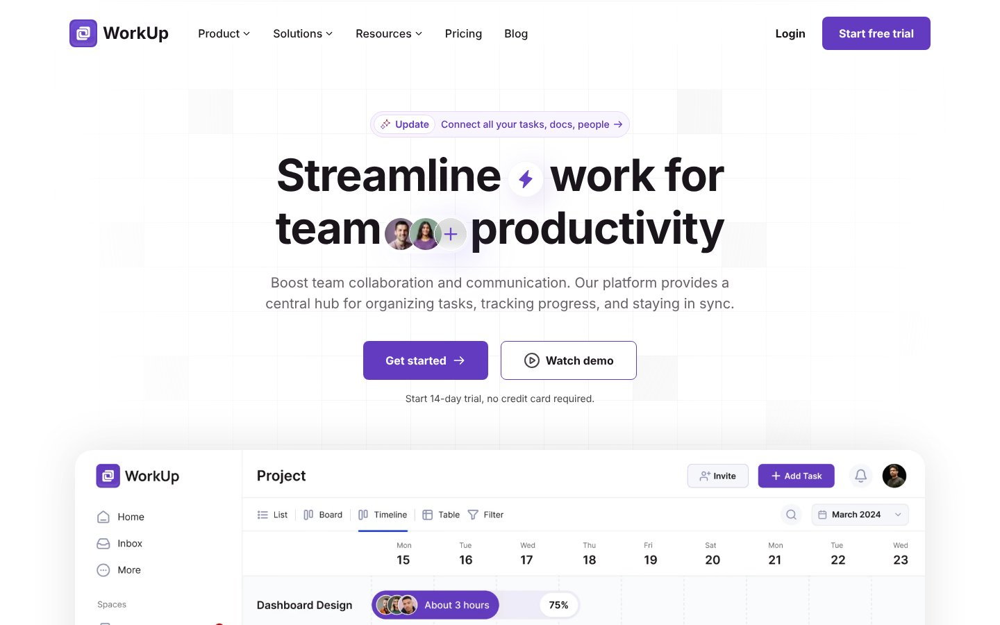

<div align="center">

# WorkUp — Project Management SaaS Landing Page (Next.js + Tailwind CSS)

A clean, high-converting **SaaS landing page template** for a project-management / team-productivity tool — built pixel-perfect from Figma with Next.js, TypeScript and Tailwind CSS.

[](https://project-management-saa-s-website.vercel.app)




</div>

## ✨ Features

- ✅ SaaS hero with free-trial CTA and product dashboard mockup
- ✅ Feature grid, integrations, logo cloud and testimonials
- ✅ Pricing section designed for trial conversions
- ✅ Reusable UI primitives (Button, Badge, Avatar, Card, Toggle)
- ✅ All copy stored as typed content data — easy to rebrand
- ✅ SEO metadata routes, Open Graph and fast Core Web Vitals
- ✅ Fully responsive, accessible components

## 🛠 Tech Stack

Next.js (App Router) · TypeScript · Tailwind CSS · React · Vercel · Framer Motion

## Development

Pixel-perfect build of the WorkUp landing page from Figma.

- **Stack:** Next.js 16 (App Router, TypeScript) · Tailwind CSS v4 · next/font (Manrope, Inter) · Framer Motion · cva + clsx + tailwind-merge
- **Hosting:** Vercel — `main` deploys to production, every other branch gets a preview URL.

## Develop

```bash
npm install
npm run dev
```

Open http://localhost:3000.

## Checks

```bash
npm run lint
npm run build
```

## Structure

| Path | Contents |
|------|----------|
| `app/` | Layout, page, metadata routes, design tokens (`globals.css`) |
| `components/ui/` | Primitives: Button, Badge, Avatar, AvatarStack, Toggle, Input, Card, SectionHeading |
| `components/sections/` | One component per landing-page section |
| `content/` | All copy and links as typed data |
| `public/figma/` | Assets exported from Figma |


---

## 👤 Designer & Developer

**Noor Hossain** — UI/UX Designer & Front-End Developer (Next.js, React, Tailwind CSS) based in Dhaka, Bangladesh. I design in Figma and ship pixel-perfect, responsive, SEO-friendly websites.

[](https://github.com/nooruiux)
[](https://wa.me/8801913264543)
[](https://www.linkedin.com/in/noorxtk/)
[](https://www.behance.net/noorxtk)
[](https://dribbble.com/Noorxtk)

💼 **Available for freelance:** landing pages, SaaS websites, Figma-to-Next.js builds, UI/UX design. ⭐ Star this repo if it helped you.

<sub>Keywords: SaaS landing page, project management website template, Next.js SaaS template, Tailwind CSS landing page, startup website, B2B SaaS UI design, Figma to code, UI/UX design, responsive web design.</sub>
